# 15-Gallon Self-Sustaining Sealed Paludarium

A fully sealed, self-sustaining miniature ecosystem combining land and water habitats in a single 15-gallon glass tank. Once built and sealed, the only input is light — everything else (water cycle, nutrient cycling, population control) runs on its own.

**Estimated total cost: ~$500**

---

## What's Inside

This repo contains everything you need to plan and build the paludarium:

| File | Description |
|------|-------------|
| [**shopping-list.html**](shopping-list.html) | Interactive checklist with prices and buy links for every item |
| [**gallery.html**](gallery.html) | Visual species gallery — hover to zoom on each creature and plant |
| [**cross-section.html**](cross-section.html) | SVG cross-section diagram showing all layers and zones |
| [**GUIDE.md**](GUIDE.md) | Full build guide with step-by-step instructions |

> Open any `.html` file in your browser — no install or setup needed.

---

## The Ecosystem at a Glance

The tank is split roughly 60% land / 40% water, with a plexiglass divider siliconed in place. Every species has a job — decomposers recycle waste into plant food, plants produce oxygen, and predators keep populations balanced. The result is a closed-loop miniature world.

### Land Side
Layered substrate (LECA drainage → charcoal → mesh → ABG soil → sphagnum moss), planted with jewel orchids, begonias, fittonia, selaginella, marcgravia, bromeliads, and mosses. Driftwood and cork bark provide structure and shelter.

### Water Side
Fine gravel substrate with rocks, planted with bucephalandra, rotala, java moss, marimo moss balls, and surface duckweed. Slightly brackish water for the opae ula shrimp.

---

## Species

### Stars of the Show

| | Species | Role | Where to Buy |
|---|---------|------|-------------|
| 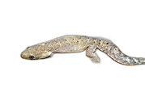 | **Mourning Geckos** *(Lepidodactylus lugubris)* ×3 | All-female, self-cloning geckos. Nocturnal, climb glass, eat springtails + fruit flies. Population self-regulates — won't overgrow. | [Amazon](https://www.amazon.com/s?k=mourning+gecko+lepidodactylus+lugubris) · [Amazon](https://www.amazon.com/s?k=mourning+gecko+live) |
| 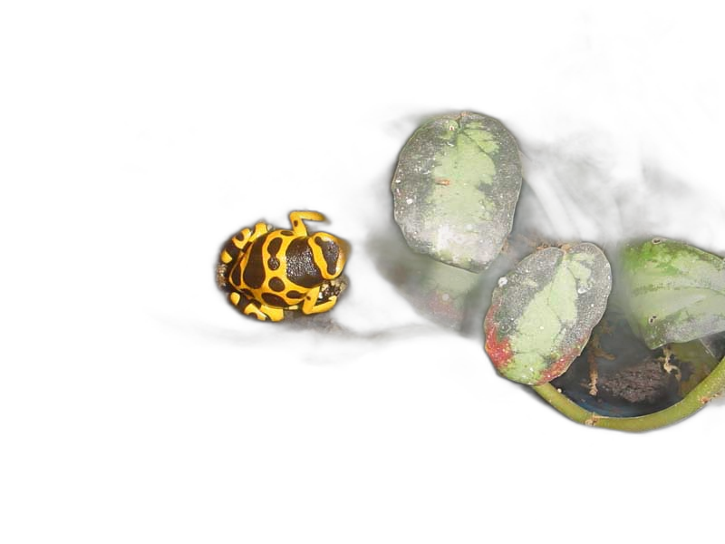 | **Bumblebee Dart Frogs** *(Dendrobates leucomelas)* ×2 | Stunning yellow + black bands. Bold, active daytime hunters. Eat fruit flies. Best beginner dart frog. | [Amazon](https://www.amazon.com/s?k=dendrobates+leucomelas+bumblebee+dart+frog) · [Amazon](https://www.amazon.com/s?k=dart+frog+live) |

### Apex Predators

| | Species | Role | Where to Buy |
|---|---------|------|-------------|
| 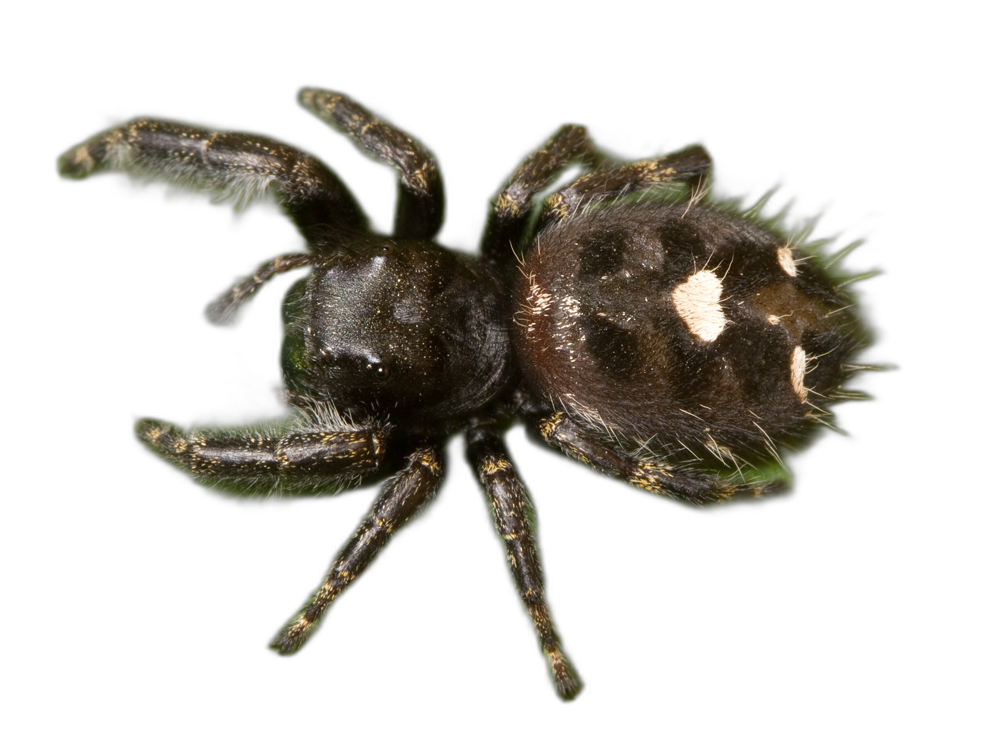 | **Bold Jumping Spider** *(Phidippus audax)* | Land apex predator — hunts fruit flies and springtails. Active, curious, and full of personality. Lives ~1 year. | [Amazon](https://www.amazon.com/s?k=bold+jumping+spider+live) · [Amazon](https://www.amazon.com/s?k=jumping+spider+phidippus+audax) |
| 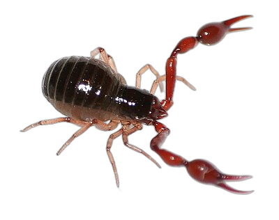 | **Pseudoscorpions** ×5–10 | Long-term backup apex predator. Tiny, hidden, breeds indefinitely. Takes over when the spider passes. | [Amazon](https://www.amazon.com/s?k=pseudoscorpion+live) · [Amazon](https://www.amazon.com/s?k=pseudoscorpion+live) |

### Land Crew

| | Species | Role | Where to Buy |
|---|---------|------|-------------|
| 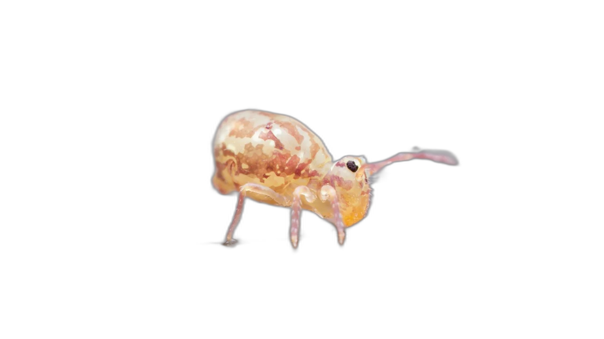 | **Springtails** ×500+ | Essential decomposers — eat mold, dead plant matter, and waste. The foundation of the cleanup crew. | [Amazon](https://www.amazon.com/s?k=springtail+culture) · [Amazon](https://www.amazon.com/s?k=springtail+culture+live) |
| 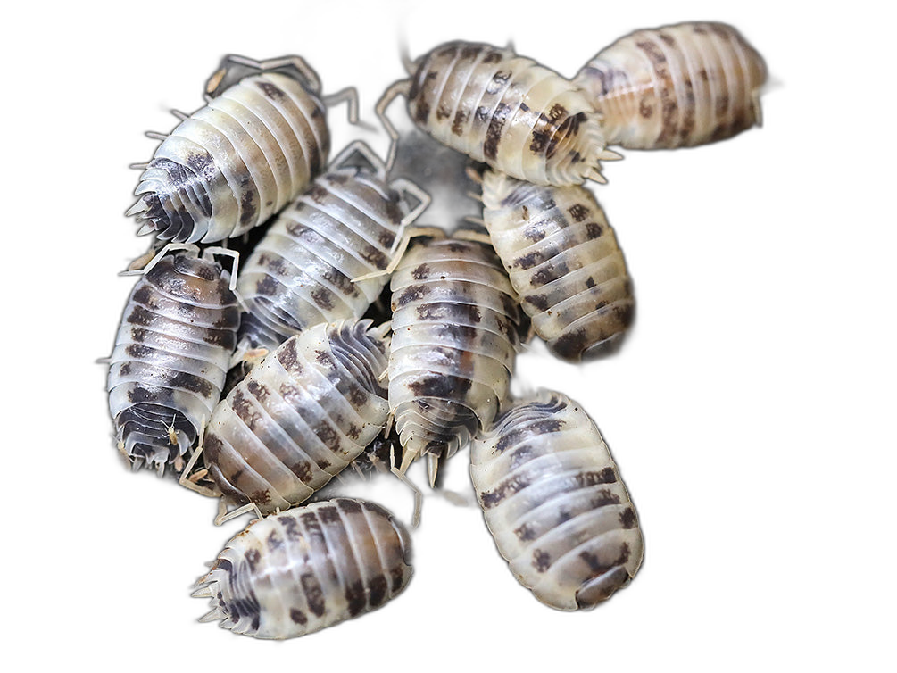 | **Dairy Cow Isopods** ×25–50 | Decomposers with striking white/black spotted pattern. Break down leaf litter and waste. | [Amazon](https://www.amazon.com/s?k=dairy+cow+isopod) · [Amazon](https://www.amazon.com/s?k=dairy+cow+isopods+live) |
| 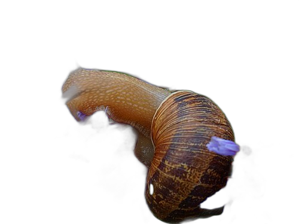 | **Small Land Snails** ×5–8 | Grazers — eat algae and decaying matter off glass and surfaces. | [Amazon](https://www.amazon.com/s?k=pet+land+snail) |
| 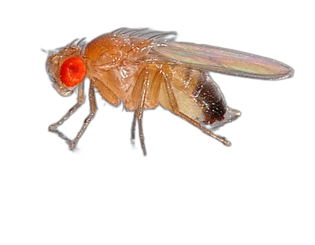 | **Flightless Fruit Flies** | Self-breeding prey for geckos, dart frogs, and spider. | [Amazon](https://www.amazon.com/s?k=flightless+fruit+fly+culture) · [Amazon](https://www.amazon.com/s?k=flightless+fruit+fly+culture) |

### Water Animals

| | Species | Role | Where to Buy |
|---|---------|------|-------------|
| 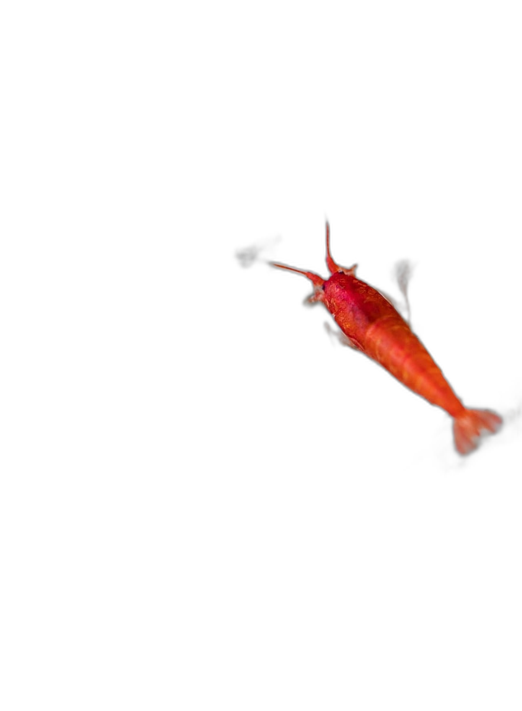 | **Opae Ula Shrimp** ×30+ | Bright red Hawaiian shrimp — live 20+ years, zero feeding needed. The stars of the water section. | [Amazon](https://www.amazon.com/s?k=opae+ula+shrimp) · [Amazon](https://www.amazon.com/s?k=opae+ula+shrimp+live) |
| 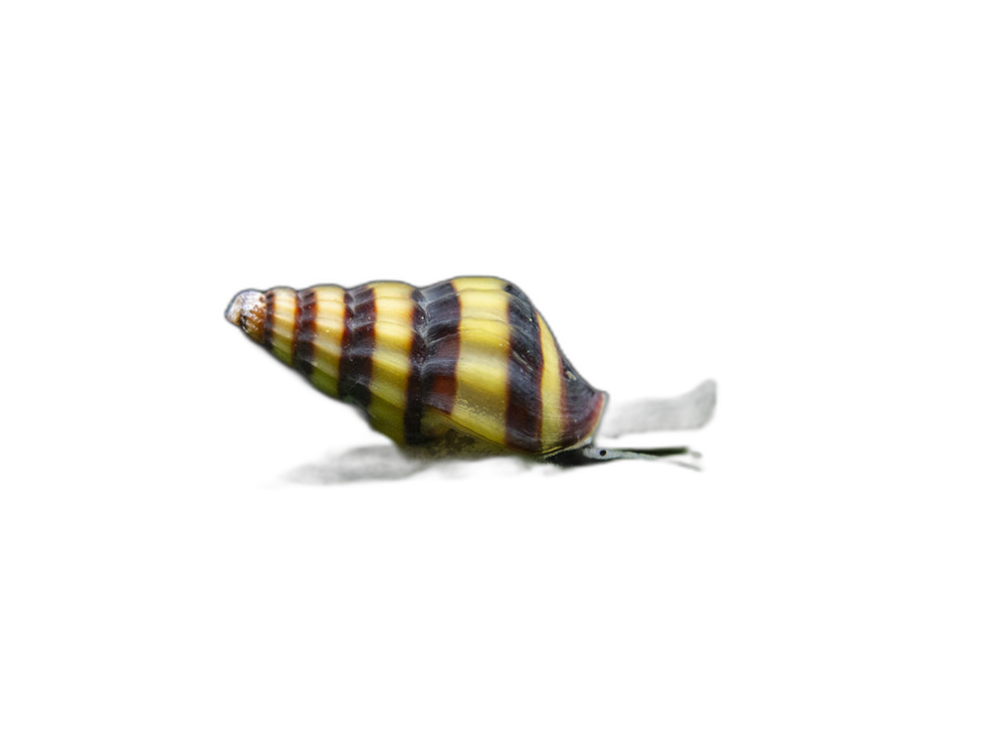 | **Assassin Snails** ×3–5 | Water apex predator — hunts ramshorn and bladder snails to control populations. Striking yellow/brown striped shells. | [Amazon](https://www.amazon.com/s?k=assassin+snail) · [Amazon](https://www.amazon.com/s?k=aquarium+snails+live) |
| 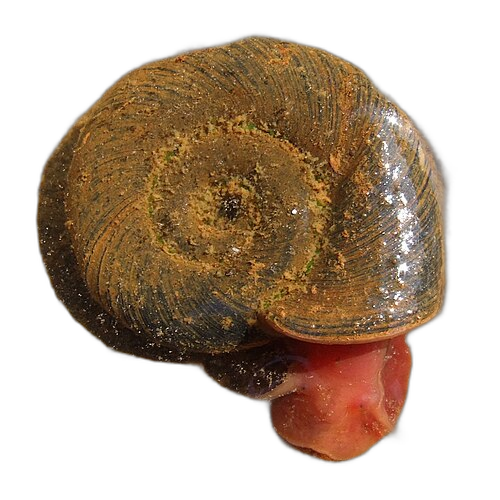 | **Ramshorn Snails** ×8–10 | Algae control and waste processing. Also prey for assassin snails. | [Amazon](https://www.amazon.com/s?k=ramshorn+snail) · [Amazon](https://www.amazon.com/s?k=aquarium+snails+live) |
| 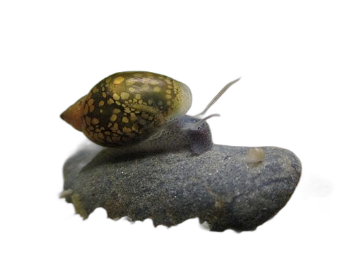 | **Bladder Snails** ×8–10 | Algae and detritus cleanup. Prey for assassin snails. | [Amazon](https://www.amazon.com/One-Stop-Aquatics-Freshwater-Bladder/dp/B00XS7TZXK) · Often free with plant orders |
| 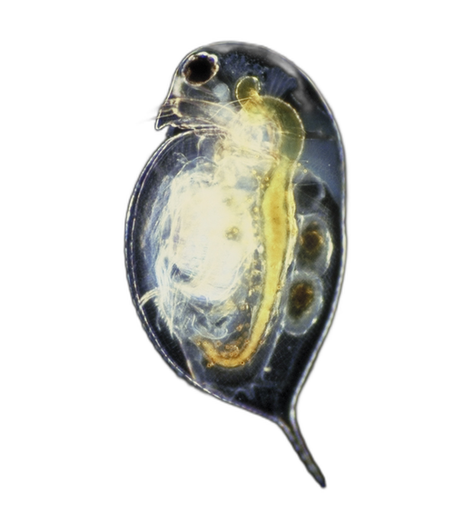 | **Daphnia** | Pulsing zooplankton swarms — mesmerizing to watch. Maintain water clarity. | [Amazon](https://www.amazon.com/s?k=daphnia+culture) |
| 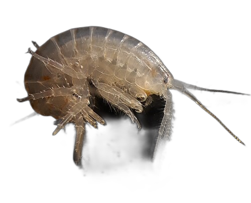 | **Scuds** (amphipods) | Fast-darting detritivores. Very active. | [Amazon](https://www.amazon.com/s?k=scud+amphipod+culture) |
| 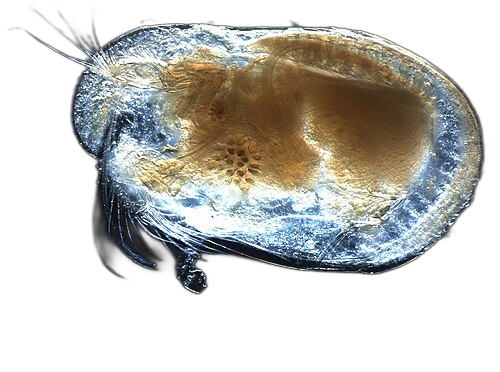 | **Ostracods** (seed shrimp) | Microfauna biodiversity layer. | [Amazon](https://www.amazon.com/s?k=ostracod+culture) · [Amazon](https://www.amazon.com/s?k=ostracod+seed+shrimp+culture) |

### Land Plants

| | Plant | Why It's Cool | Where to Buy |
|---|-------|--------------|-------------|
| 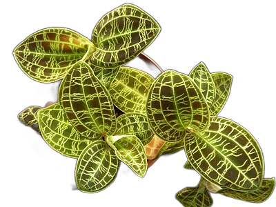 | **Jewel Orchid** *(Macodes petola)* | Dark velvety leaves with glowing gold lightning-bolt veins. The showpiece. | [Amazon](https://www.amazon.com/s?k=macodes+petola+jewel+orchid) · [Amazon](https://www.amazon.com/s?k=terrarium+plants+live) |
| 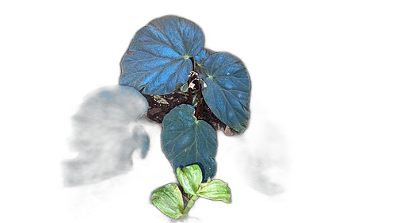 | **Peacock Begonia** *(B. pavonina)* | Iridescent blue-green shimmer under low light. | [Amazon](https://www.amazon.com/s?k=begonia+pavonina+peacock) · [Amazon](https://www.amazon.com/s?k=begonia+pavonina+terrarium) |
| 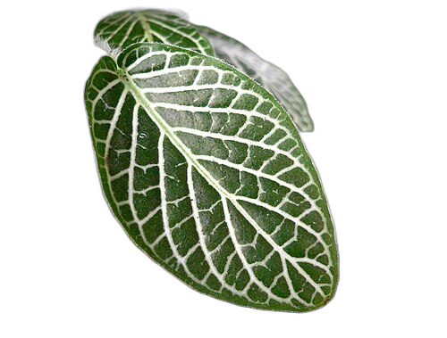 | **Fittonia** ×2–3 | Near-neon pink/white veined leaves under grow lights. | [Amazon](https://www.amazon.com/s?k=fittonia+plant) · [Amazon](https://www.amazon.com/s?k=fittonia+terrarium+plant) |
|  | **Ruby Red Selaginella** | Deep red undersides — much more striking than plain green. | [Amazon](https://www.amazon.com/s?k=selaginella+erythropus+ruby+red) · [Amazon](https://www.amazon.com/s?k=selaginella+terrarium+plant) |
| 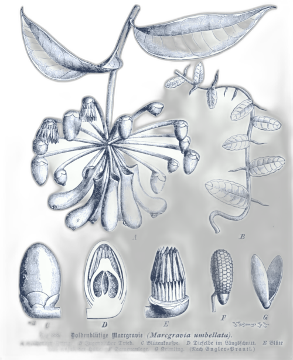 | **Marcgravia** | Shingling vine that climbs in geometric patterns — almost alien-looking. | [Amazon](https://www.amazon.com/s?k=marcgravia+sintenisii+terrarium) · [Amazon](https://www.amazon.com/s?k=terrarium+plants+live) |
| 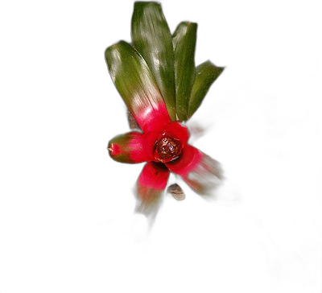 | **Miniature Bromeliad** *(Neoregelia)* | Bright reds/pinks. Holds tiny water pools in its center cup. | [Amazon](https://www.amazon.com/s?k=miniature+neoregelia+bromeliad) · [Amazon](https://www.amazon.com/s?k=terrarium+plants+live) |
| 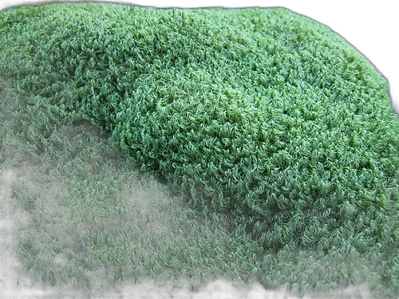 | **Mood Moss** *(Dicranum)* | Fluffy mounded texture. Lush forest floor look. | [Amazon](https://www.amazon.com/s?k=mood+moss+terrarium) · [Amazon](https://www.amazon.com/s?k=mood+moss+live+terrarium) |

### Water Plants

| | Plant | Why It's Cool | Where to Buy |
|---|-------|--------------|-------------|
| 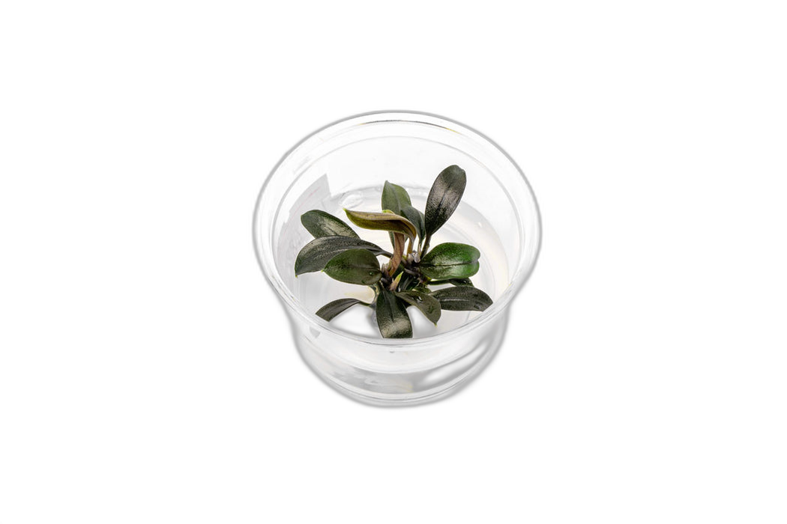 | **Bucephalandra** | Metallic sheen — comes in reds, blues, greens. Attaches to rocks. | [Amazon](https://www.amazon.com/s?k=bucephalandra+live+aquarium+plant) · [Amazon](https://www.amazon.com/s?k=bucephalandra+aquarium+plant) |
| 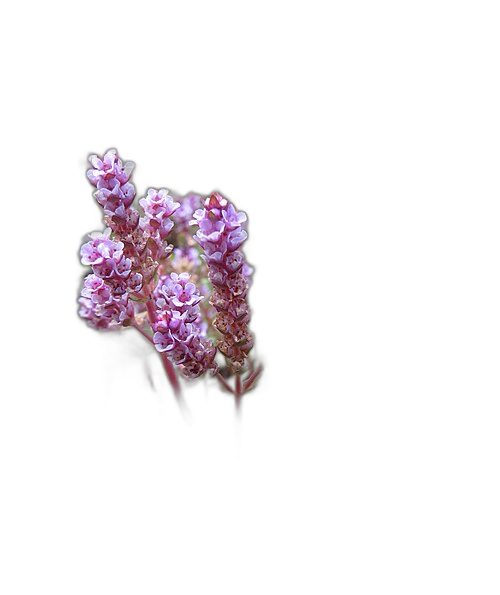 | **Rotala rotundifolia** | Turns pink/red under good light. Adds warm color to the water. | [Amazon](https://www.amazon.com/s?k=rotala+rotundifolia+live) · [Amazon](https://www.amazon.com/s?k=rotala+rotundifolia) |
| 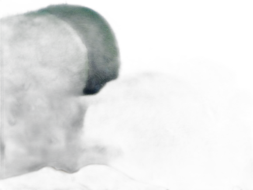 | **Marimo Moss Balls** ×2–3 | Perfectly round, velvety green. Slow-growing and iconic. | [Amazon](https://www.amazon.com/s?k=marimo+moss+ball) · [Amazon](https://www.amazon.com/s?k=marimo+moss+ball+live) |
|  | **Java Moss** | Oxygenation, shrimp habitat. The go-to aquatic moss. | [Amazon](https://www.amazon.com/s?k=java+moss) · [Amazon](https://www.amazon.com/s?k=java+moss+live+aquarium) |

---

## Hardware & Supplies — Where to Buy

| Item | Price | Link |
|------|-------|------|
| 15-gal rimless glass tank + lid | $110 | [Amazon](https://www.amazon.com/s?k=15+gallon+rimless+aquarium) |
| Aquarium-safe silicone sealant | $8–12 | [Amazon](https://www.amazon.com/s?k=aquarium+safe+silicone+sealant) |
| Plexiglass divider sheet | $5–10 | [Amazon](https://www.amazon.com/s?k=plexiglass+sheet+aquarium) |
| LED grow light + timer | $20–35 | [Amazon](https://www.amazon.com/s?k=led+grow+light+terrarium+timer) |
| LECA (drainage layer) | $8–12 | [Amazon](https://www.amazon.com/s?k=LECA+clay+balls) |
| Activated charcoal (horticultural) | $6–10 | [Amazon](https://www.amazon.com/s?k=horticultural+charcoal) |
| ABG mix terrarium soil | $10–15 | [Amazon](https://www.amazon.com/s?k=ABG+mix+terrarium+soil) · [Amazon](https://www.amazon.com/s?k=ABG+mix+terrarium+substrate) |
| Long-fiber sphagnum moss | $6–10 | [Amazon](https://www.amazon.com/s?k=sphagnum+moss+terrarium) |
| Fine aquarium gravel | $5–8 | [Amazon](https://www.amazon.com/s?k=fine+aquarium+gravel+black) |
| Driftwood | $5–10 | [Amazon](https://www.amazon.com/s?k=aquarium+driftwood+small) |
| Cork bark | $5–8 | [Amazon](https://www.amazon.com/s?k=cork+bark+terrarium) |
| Dried leaf litter | $5–8 | [Amazon](https://www.amazon.com/s?k=leaf+litter+terrarium) |
| Marine aquarium salt | $5–8 | [Amazon](https://www.amazon.com/s?k=marine+aquarium+salt) |
| Water conditioner | $4–6 | [Amazon](https://www.amazon.com/s?k=aquarium+water+conditioner) |
| Aquascaping tweezers | $8–12 | [Amazon](https://www.amazon.com/s?k=aquascaping+tweezers) |
| Spray bottle | $3–5 | [Amazon](https://www.amazon.com/s?k=fine+mist+spray+bottle) |

---

## How It Works

Once sealed, the ecosystem runs itself:

```
   Sunlight (LED)
       │
       ▼
   Plants photosynthesize → O₂ out, CO₂ in
       │
       ▼
   Water evaporates → condenses on glass → drips back (rain cycle)
       │
       ▼
   Dead matter falls → springtails & isopods decompose it → nutrients
       │
       ▼
   Nutrients feed plants → cycle repeats
       │
       ▼
   Prey breeds (snails, flies, springtails) → predators hunt them
       │
       ▼
   Predator waste → decomposed by cleanup crew → feeds plants
```

The only external input is the **LED grow light on a 10–12 hour timer**.

---

## Build Timeline

| Day | What to Do |
|-----|-----------|
| **Day 1** | Build tank structure — divider, substrate layers, hardscape |
| **Day 2** | Plant everything (land + water). Add water. |
| **Days 2–4** | Let it sit 48 hours — water chemistry stabilizes |
| **Day 4** | Add microfauna: springtails, isopods, ostracods, daphnia |
| **Day 7** | Add snails and scuds |
| **Day 10** | Add opae ula shrimp and assassin snails |
| **Day 14** | Add fruit fly culture |
| **Day 21** | Add pseudoscorpions and jumping spider. Seal the tank. |
| **Week 3–6** | Monitor — after conditions stabilize, walk away and enjoy |

See [GUIDE.md](GUIDE.md) for the full step-by-step build instructions.

---

## Key Notes

- **Temperature:** Keep at room temp (65–80°F). No direct sunlight — it will overheat and kill everything.
- **Spider lifespan:** ~8–14 months. When it dies, pseudoscorpions seamlessly take over as apex predator. The body gets recycled by springtails.
- **Opae ula water:** Slightly brackish (1 tbsp marine salt per gallon). Mix before adding animals.
- **If you see mold:** Don't panic. Springtails eat it. Give them a week or two.
- **Condensation:** Light morning fog on glass = perfect. Heavy fog = too wet (briefly unseal). No fog = too dry (mist and reseal).

---

*Built with research, planning, and a lot of excitement about tiny ecosystems.*
